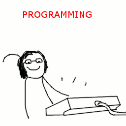

##Programming Resources!

The goal of this repo is to collect a mass of online and physical resources for our students here at Grand Circus. Because we believe in the power of Open Source we are opening the repo to the world and letting anyone contribute. For now we will keep all of the resources in this readme file.

**Guidelines**
-Please list specific items rather than general recommendations (i.e. 'you should read this blog').
- Do not list pirated or illicit copies of copyrighted material. Many books are publised for free online, that's fine. For book recommendations which are not available online include a a link to amazon or a kindle page.
`

###JavaScript
- General
  - [Eloquent JavaScript (free eBook)](http://www.eloquentjavascript.com)
  - [Learning JavaScript (free eBook)](http://addyosmani.com/resources/essentialjsdesignpatterns/book/)
  - [ToDoMVC](http://todomvc.com), To Do List implemented in a variety of JS frameworks
- Angular.js
  - [Egghead](http://egghead.io), (Angular screen casts, paid but some lessons are free)
  - Directives
    - [A Practical Guide to Angular Directives, Part 1](http://www.sitepoint.com/practical-guide-angularjs-directives/)
    - [A Practical Guide to Angular Directives, Part 2](http://www.sitepoint.com/practical-guide-angularjs-directives-part-two/)
- Backbone.js
  - [Hello Backbone!](http://arturadib.com/hello-backbonejs/)
- CoffeeScript
 - [Hard Rock CoffeeScript](http://hardrockcoffeescript.org)
- Express
  - [THE DEAD-SIMPLE STEP-BY-STEP GUIDE FOR FRONT-END DEVELOPERS TO GETTING UP AND RUNNING WITH NODE.JS, EXPRESS, JADE, AND MONGODB](http://cwbuecheler.com/web/tutorials/2013/node-express-mongo/)
- Node.js & IO.js
  - [Getting Started with node (huge list of stuff)](http://stackoverflow.com/questions/2353818/how-do-i-get-started-with-node-js)
  - [Learnyounode](https://github.com/workshopper/learnyounode)

###IOS
- Objective-C
- Swift
  - [Building an iOS app with Swift](https://www.airpair.com/swift/building-swift-app-tutorial)

###Miscellaneous
- Software Craftsmanship
  - [Rules of Simple Design, Game of Life examples](https://www.youtube.com/watch?v=ooIy0yk44t8)
  - [Understanding the Rules of Simple Design, Corey Haines (not-free book)](https://leanpub.com/4rulesofsimpledesign)
- Functional Programming
- Podcasts
 - [Full Stack Radio](http://fullstackradio.com)
- Learning
 - [Team Treehouse (paid)](https://teamtreehouse.com)
- Lists of Resources
 - [Awesome list of Awesome](https://github.com/sindresorhus/awesome) (Huge & Comprehensive)

###PHP
- General
 - [PHP the Right Way](http://www.phptherightway.com/)
 - [awesome-php](https://github.com/ziadoz/awesome-php)
- Slim
  - [Taming Slim 2.0](http://code.tutsplus.com/tutorials/taming-slim-20--net-30669)
  - [Slim PHP Microframework (Conference Talk)](https://www.youtube.com/watch?v=yEA0VWHCFac)
- Laravel / Lumen
 - [Laravel Podcast](http://www.laravelpodcast.com/)

###Preprocessors
- Sass
  - [Get Sassy with CSS](http://sassshop.com)
- Stylus / Jade
  - [Express, Jade, Stylus Demo [Node.js]](http://code.runnable.com/U_kP7TNQ2DxbGg7d/express-jade-stylus-demo-for-node-js)

###Python
- General
  - [The Python Tutorial](https://docs.python.org/2/tutorial/)
- Django
  - [Writing Your First Django App](https://docs.djangoproject.com/en/1.8/intro/tutorial01/)
- Flask
  - [Flask Project Tutorial](http://flask.pocoo.org/docs/0.10/tutorial/)

###Server Administration / Local Development
- General
  - [Servers for Hackers](https://serversforhackers.com)(The book is great)
- Terminal
  - [The Command Line Crash Course](http://cli.learncodethehardway.org/book/) - Good beginner intro to using the terminal
  - [Learning the Shell](http://linuxcommand.org/lc3_learning_the_shell.php) - Looks like a more intermediate tour of the shell. Linux specific but should work for OSX as well.
  - [40 terminal tips and tricks you never thought you needed mac](http://computers.tutsplus.com/tutorials/40-terminal-tips-and-tricks-you-never-thought-you-needed--mac-51192) - Slightly annoying listicle with some nice gems like `ditto` and `caffeinate`
- Vagrant
  - [Get Vagrant Up and Running](https://scotch.io/tutorials/get-vagrant-up-and-running-in-no-time)
  - [Up and Running with Vagrant](https://serversforhackers.com/video/up-and-running-with-vagrant)

###APIs
- Planning / Best Practices
  - [Build APIs You Won't Hate](https://leanpub.com/build-apis-you-wont-hate)

###Practice
  1. Beginner
    - [W3 Resources - HTML, CSS](http://www.w3resource.com/html-css-exercise/index.php)
    - [W3 Resources - JavaScript](http://www.w3resource.com/javascript-exercises/)
    - [W3 Resources - jQuery](http://www.w3resource.com/jquery-exercises/)
    - [Bonfire](http://www.freecodecamp.com/challenges/bonfire-meet-bonfire)
    - [Code Wars](http://codewars.com/)
    - [Code Fight](http://codefights.com/)

  1. Intermediate
    - [Project Euler](https://projecteuler.net/)

  1. Advanced
    - [Screeps](https://screeps.com/) - An MMO for programmers.
    - [Fruit Robots](http://fruitbots.herokuapp.com/) - Program tiny robots to collect fruit and compete with other bots.

